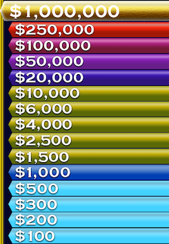
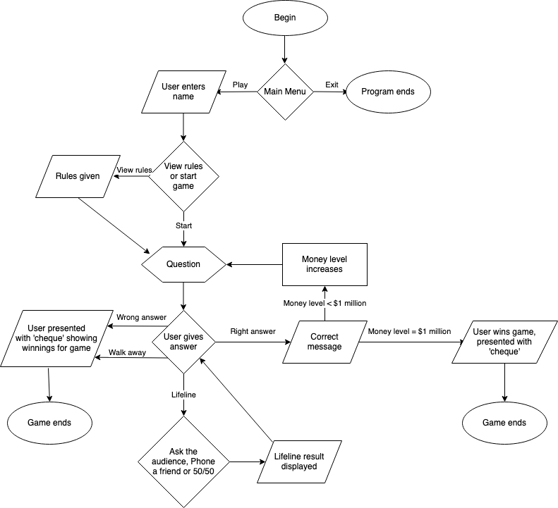

# Who wants to be a Millionaire Terminal App

## Description
15 Questions stand between you and $1 million. Let's play Who Wants to be a Millionaire!

The Who Wants to be a Millionaire Terminal App is a Terminal-based game designed to simulate the experience of being a contestant on the long-running quiz show. The user will be presented with multiple-choice questions, with each correct answer increasing their prize and, consequently, the difficulty of the questions. If the user answers 15 questions in a row correctly, they will beat the game and 'win' $1 million.

## How to install
Clone or download the project to your computer.

If you are on a Windows machine, you will need to have Ruby installed.

You can install Ruby here: https://rubyinstaller.org/

Then, using your computer's command line, navigate to the root folder 'Daniel_Hinton_T1A2'

You're now ready to go! type in `ruby play.rb` and get ready to play for $1 million!

## Features
##### 1. The Questions
The questions are the most important part of the app and comprise the bulk of it's data. Each question has four possible answers, one of which is correct. The questions have 15 difficulties, ranging from \$100 (the easiest) to \$1 million (the hardest). 

Each question will be structured in Ruby as a loop, where the user returns to the question and:
* If they have answered the question correctly, the question will change to the next one in the 'question stack' array generated randomly from the question bank at the start of each game.
* If they opt to use a lifeline (explained below), the lifeline results will be displayed.
* If they answer incorrectly or opt to walk away, the loop will break.
* If the question is the $1 million dollar one and the user is correct, the loop will break and the user will win the game.

##### 2. The Money Tree
The user starts a new game with the \$100 question. If they get that right, they move to the \$200 question, and so forth until they either get a question wrong, or answer all 15 questions correctly.

Each question has a corresponding monetary value, as seen below:

\$1,000 and \$10,000 are safe levels. Once the user gets those questions right, they are guaranteed to walk away with that money, even if they go on to get a question wrong.

##### 3. The Lifelines
Just like in the TV show, users will have three lifelines they can use once during each game:

* Ask the Audience - Ask a virtual studio audience the question and receive a poll of their answers. The results are shows as a pie chart using the tty-pie gem.
* Phone a Friend - Phone a 'friend' and receive their take on the question. There are 8 possible phone a friend responses ranging from 100% certainty of the answer to no idea.
* 50/50 - Remove two incorrect answers leaving a choice between only the right answer and one remaining wrong answer.

##### 4. Walk Away
At any point in the game, the user may elect to walk away, and take all the money they have earned up to that point home with them. But if they choose not to and get a question wrong, they will lose all the money they have earned, with the exception of any safe levels they have passed.

##### 5. The Host
The game wouldn't be complete without a host, and that's where our very own, virtual Eddie McGuire comes in. Complete with quips, jokes and comments, the virtual Eddie provides a fun aspect to the game and helps increase its realism.
The virtual eddie is an array of 'quips', one of which is selected randomly after a question has been answered correctly. There are also more lines from virtual Eddie which do not change from game to game (such as asking 'What is your name?') and they are located in the play.rb file

### Control Flow

## Troubleshooting
Make sure you have the latest version of Ruby installed. You can check this on your command line with the command `ruby -v`. The latest version is 2.7.0

If you encounter any errors with the program, you can create an issue log on github: https://github.com/djh900/Daniel_Hinton_T1A2/issues