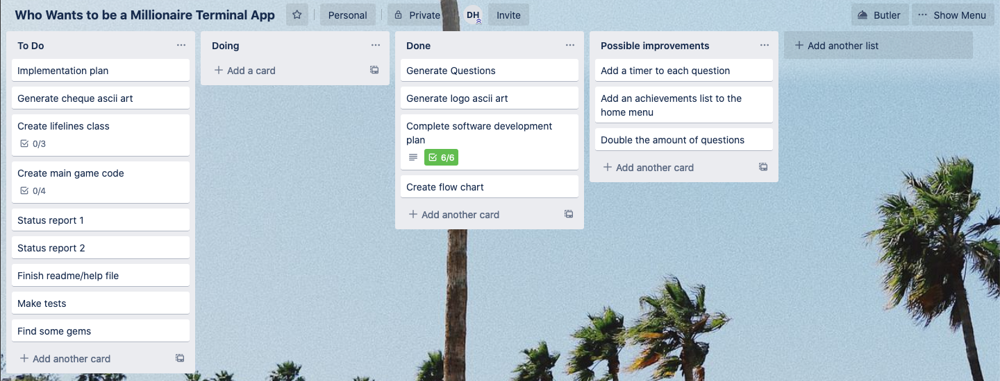
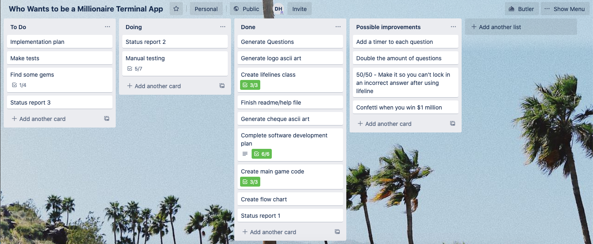
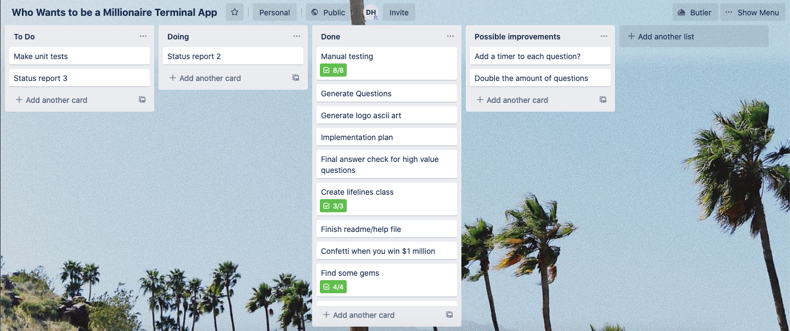

# Development Log
You can view the Trello board for this project at https://trello.com/b/57GHMngp/who-wants-to-be-a-millionaire-terminal-app
### Day 1
##### Friday, April 24, 3:00pm
After four days of being violently ill, it's time to get started on this project. I guess this code assignment just turned into a code sprint but that's okay - always up for a challenge.

I was able to do some work on the project on monday before falling ill, such as generating the questions and creating the development plan. The Trello board for the project is currently looking like this:

Well, time to get to work. The plan for today is to finish the first draft of the code, then debug and test it tomorrow.

##### Saturday, April 25, 1:30am
Wow, that was crazy. My first day spent completely coding something from scratch. It was hard work. It was super frustrating, encountering error after error. But finally, the app seems to be working. Of course, I will test it with greater scrutiny tomorrow but for the most part, the reward has been worth the effort.

The Trello board now looks like this:

Until tomorrow.

### Day 2
##### Saturday, April 25, 7:00pm
Well, the app is finished and has been extensively manually tested. Everything seems to be working as expected. Hard work but it has paid off. The Trello board now looks like this:

The tasks to do now are:
* Develop some unit tests to test the functions in the src/functions.rb file
* Double the amount of questions in the question bank to 130
* Try and implement a timer for each question. Can it be done? I will find out

